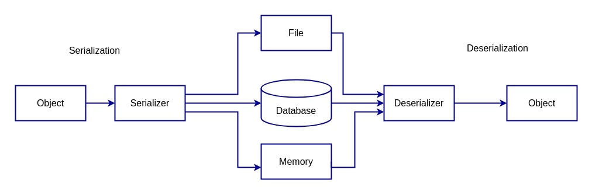

# Тема 11, Сериализация, 16.05.2023

## Работа с файлове

```c++

#include <fstream>
#include <string>

int main () {
    std::ofstream outFile;
    std::ifstream inFile;
    
    outFile.open("out.txt");
    inFile.open("in.txt");
    
    outFile << "Hello World!";

    int a;
    inFile >> a;

    std::string input;
    getline(file, input);
    
    outFile.close();
    inFile.close();

    return 0;
}
```

## Сериализация и Десериализация 



## Задачи

### Зад. 1 - [Решение](./solutions/triangle/)

За [класа Triangle от седмица 3](../03-classes/solutions/triangle.cpp) напишете функция, която:

* Приема един триъгълник и един поток за писане и която сериализира триъгълника в потока
* Приема поток за четене, десериализира съдържанието му и връща триъгълник

Напишете тест, който проверява, че обектът преди сериализация е същият като обекта след десериализация.

### Зад. 2 - [Решение](./solutions/hotel/)

Създайте клас `Hotel`. Всеки клас се характеризира с уникален идентификатор, име, адрес, координати и брой стаи. Напишете функции, които сериалзират и десериализират вектор от хотели в [CSV формат](https://dev.socrata.com/docs/formats/csv.html).

### Зад. 3

Дефинирайте оператори за сериализация(`<<`) и десериализация(`>>`) на [класа BankProfile от седмица 9](../09-inheritance/solutions/bank.h).


