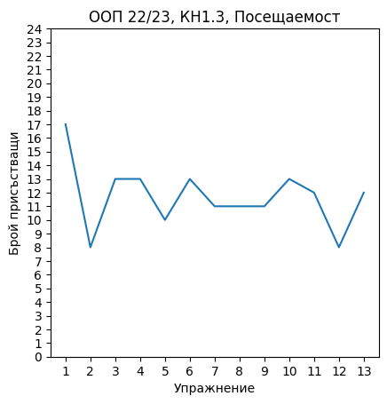

# Подготовка за изпит, 06.06.2023

## Статистика за семестъра

### Общо решени задачи - **55**

### Общо имплементирани класове - **20**

<br/>



<br/>

Студентът, посетил всяко едно упражнение - **???**


## Задачи

### Зад. 1

Имплементирайте йерархия, която представя ценообразуване(пример: ценообразуване на престой в хотел). Една цена може да се плати в момента на закупуване/поръчване или в момента на получаване/използване. За целта имплемнтирайте базов (абстрактен) клас `Pricing` с два наследника `PayNow` и `PayLater`. В базовия клас добавете следните методи:

* `bool isPayNow()`
* `bool isPayLater()`
* `double price()`
* `std::string currency()`

### Зад. 2

Имплементирайте шаблонна функция, която приема списък от обекти и функция, която извлича цената за даден обект. Функцията да връща най-евтиния обект.

```c++
template <typename T>
T cheapest(std::vector<T> items, std::function<Pricing(T)> getPrice);
```

### Зад. 3

Имплементирайте клас `Catalogue`, който представя каталог на продукти с техните цени. Всеки продукт се представя чрез уникален идентификатор. Добавете:

* голяма четворка
* метод `void addProduct(std::string id, Pricing pricing)`

### Зад. 4

Имплементирайте сериализация и десериализация за класа `Catalogue`